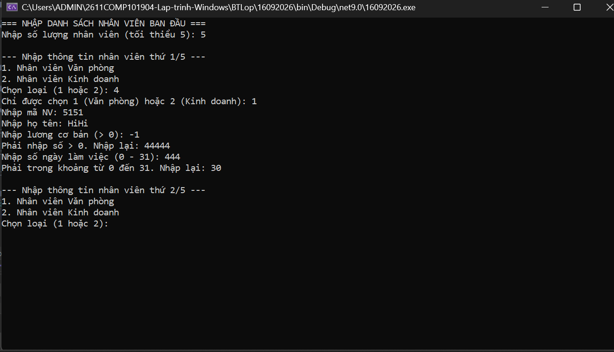
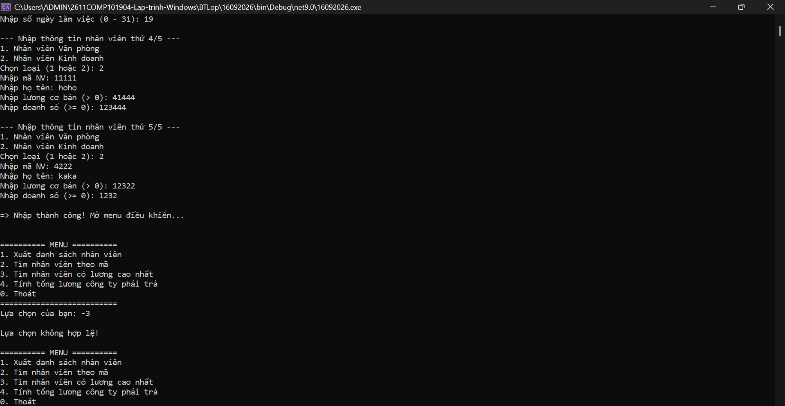
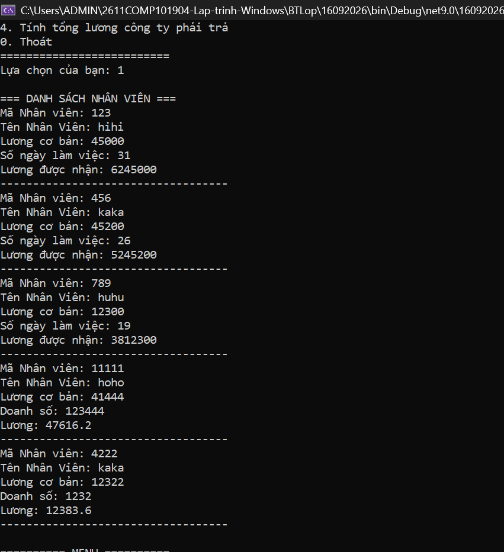
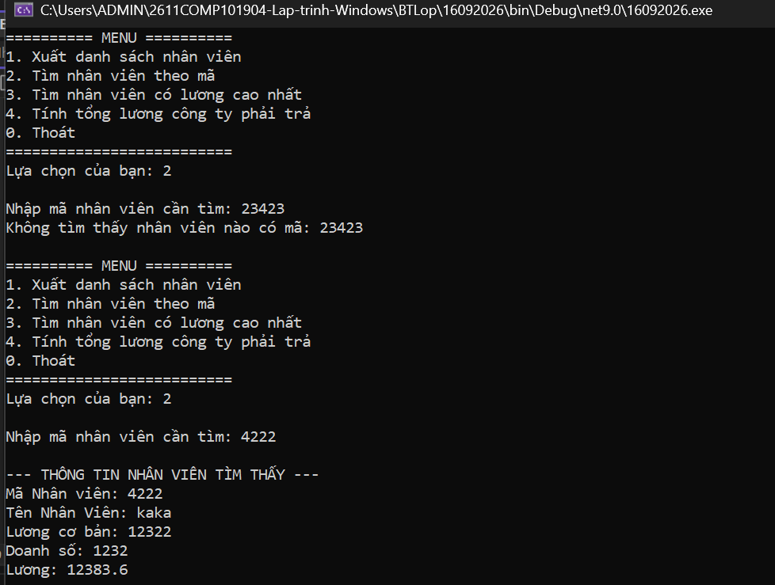
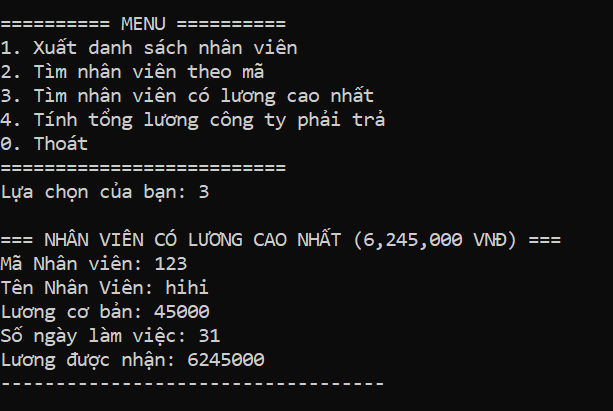
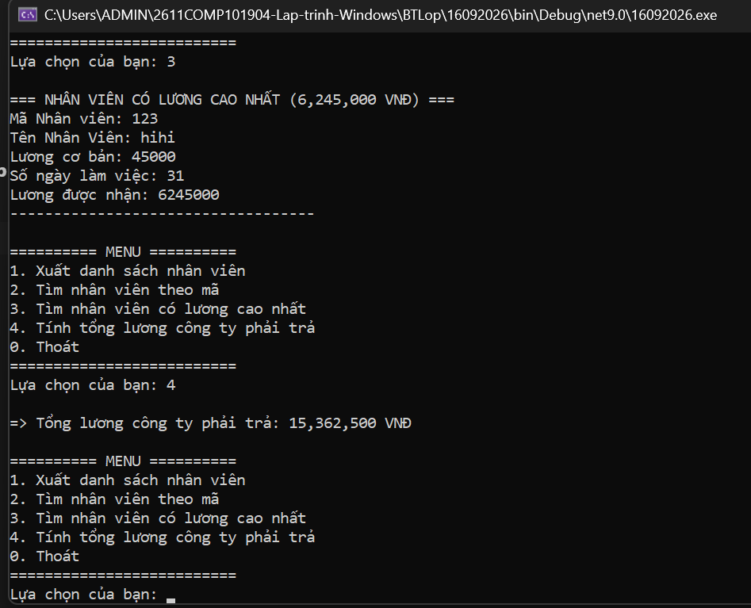
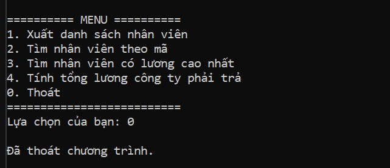

Bài tập trên lớp – Quản lý nhân viên

1. Thông tin bài tập

Học phần: COMP1019 – Lập trình trên Windows

Ngày thực hiện: 16/09/2026

Hình thức: Console C#

Chủ đề: Quản lý nhân viên

Kiến thức áp dụng: Class, Property, Constructor, Encapsulation, Kế thừa và Đa hình.

2. Mô tả bài tập

Xây dựng chương trình Console C# quản lý danh sách nhân viên.

Chương trình có lớp cha NhanVien và ba lớp con:

NhanVienVanPhong

NhanVienKinhDoanh

Thêm 1 lớp bổ sung là NhanVienThoiVu

Mỗi loại nhân viên có cách tính lương khác nhau và sử dụng đa hình (Polymorphism) thông qua phương thức TinhLuong() và HienThiThongTin().

3. Chức năng chính

Chương trình hỗ trợ các chức năng:

Nhập danh sách nhân viên, yêu cầu tối thiểu 5 nhân viên.

Xuất danh sách nhân viên.

Tìm nhân viên theo mã.

Tìm nhân viên có mức lương cao nhất.

Tính tổng lương công ty phải trả.

Thoát chương trình.

## Ảnh nhập danh sách nhân viên 

## Ảnh các chức năng

## Ảnh Menu số 1 xuất ra Nhân Viên

## Ảnh Menu số 2 tìm nhân viên theo mã nhân viên

## Ảnh Menu số 3 tìm nhân viên lương cao nhất

## Ảnh Menu số 4 tính tổng lương công ty phải trả

## Ảnh Menu số 5 thoát

4. Các loại nhân viên

Nhân viên văn phòng

Có số ngày làm việc từ 0 đến 31.

Công thức tính lương:

Lương = Lương cơ bản + Số ngày làm việc × 200.000

Nhân viên kinh doanh

Có doanh số lớn hơn hoặc bằng 0.

Công thức tính lương:

Lương = Lương cơ bản + 5% × Doanh số

5. Kiến thức đã áp dụng

Class

Xây dựng các lớp NhanVien, NhanVienVanPhong và NhanVienKinhDoanh.

Property

Sử dụng Property với get/set để quản lý và kiểm tra dữ liệu.

Constructor

Sử dụng Constructor để khởi tạo thông tin nhân viên.

Encapsulation

Các thuộc tính dữ liệu được khai báo private và truy cập thông qua Property.

Inheritance

NhanVienVanPhong và NhanVienKinhDoanh kế thừa từ lớp NhanVien.

Polymorphism

Sử dụng virtual và override cho:

TinhLuong()

HienThiThongTin()

Danh sách được khai báo:

List<NhanVien> danhSach = new List<NhanVien>();

Nhờ đó có thể lưu nhiều loại nhân viên và gọi phương thức đúng theo từng lớp con.

6. Kiểm tra dữ liệu

Chương trình có kiểm tra dữ liệu đầu vào:

Số lượng nhân viên phải từ 5 trở lên.

Lương cơ bản phải lớn hơn 0.

Số ngày làm việc từ 0 đến 31.

Doanh số phải lớn hơn hoặc bằng 0.

Lựa chọn menu phải hợp lệ.

Sử dụng TryParse để hạn chế lỗi khi nhập dữ liệu.

7. Kết quả thực hiện

Chương trình đã hoàn thành các yêu cầu chính của bài tập:

Xây dựng lớp NhanVien

Xây dựng lớp NhanVienVanPhong

Xây dựng lớp NhanVienKinhDoanh

Constructor và Property

Encapsulation

Kế thừa

Đa hình

Nhập tối thiểu 5 nhân viên

Xuất danh sách

Tìm nhân viên theo mã

Tìm nhân viên có lương cao nhất

Tính tổng lương công ty

Kiểm tra dữ liệu đầu vào

8. Kết luận

Bài tập giúp áp dụng các kiến thức cơ bản về lập trình hướng đối tượng trong C#, đặc biệt là đóng gói, kế thừa và đa hình thông qua một chương trình quản lý nhân viên thực tế.