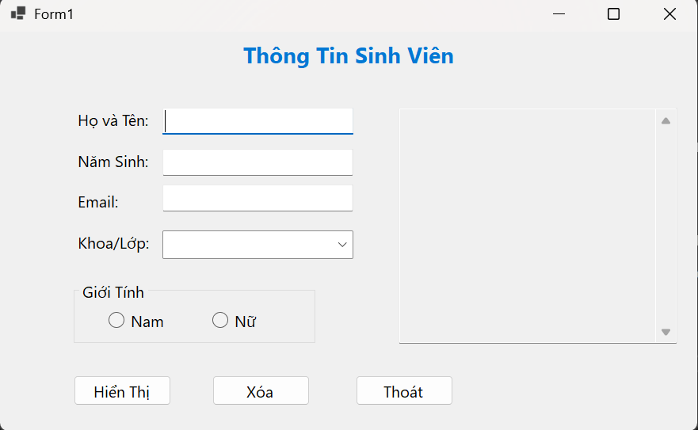
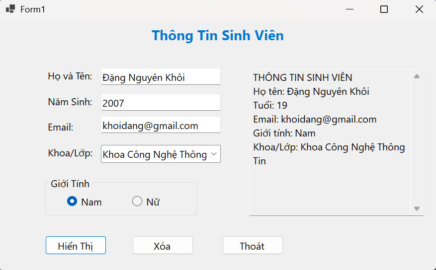
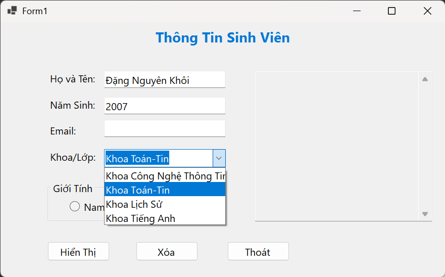
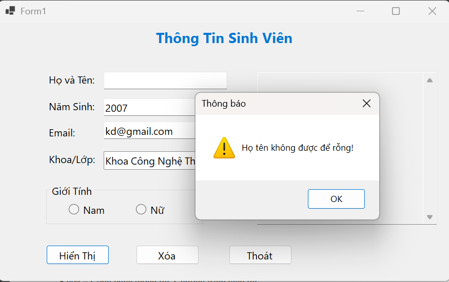
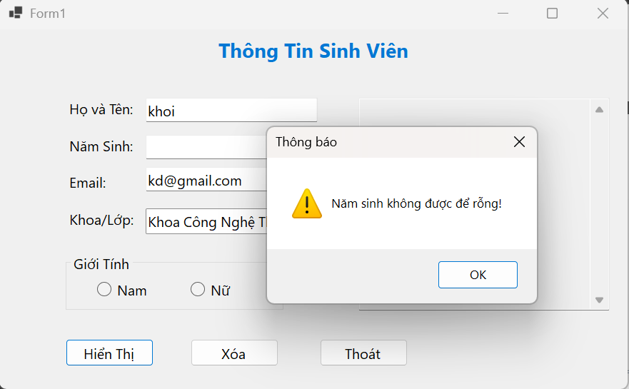
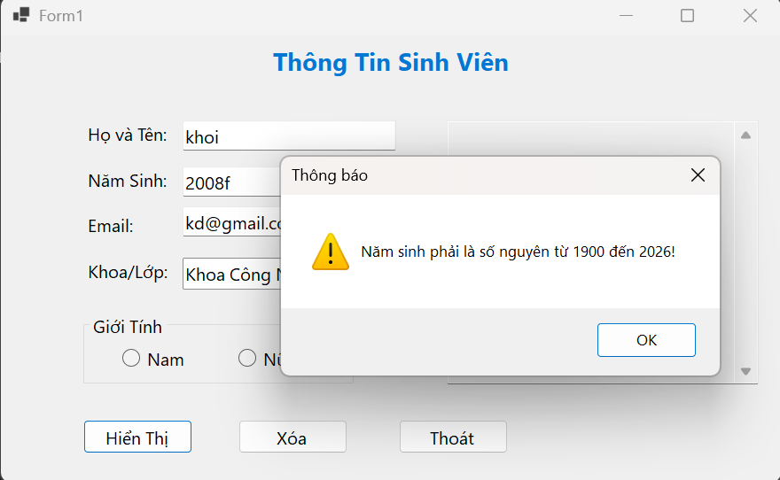
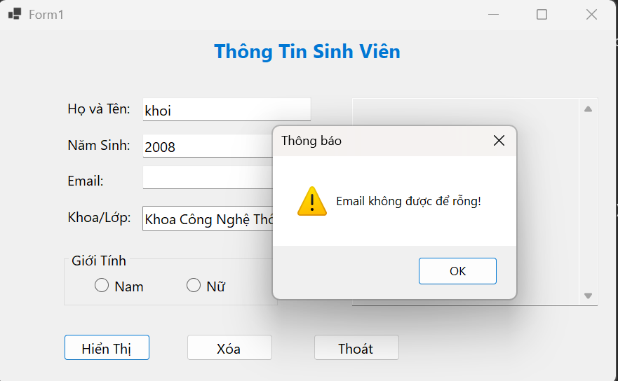
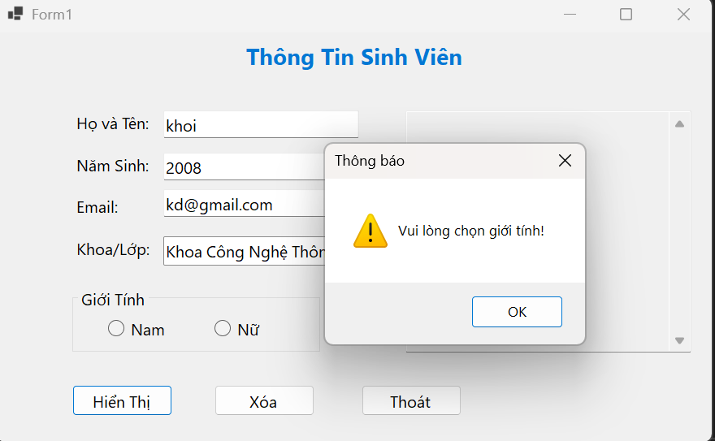

LAB 01 - ỨNG DỤNG THÔNG TIN CÁ NHÂN

1. Mô tả bài tập

Xây dựng ứng dụng Windows Forms cho phép người dùng nhập và hiển thị
thông tin cá nhân của sinh viên.

Thông tin cần nhập gồm: - Họ và tên - Năm sinh - Email - Giới tính -
Khoa/Lớp

Sau khi nhấn nút Hiển thị, chương trình kiểm tra dữ liệu đầu vào.
Nếu dữ liệu hợp lệ, chương trình tính tuổi và hiển thị thông tin sinh
viên.

2. Giao diện chương trình

Giao diện gồm các control: - Label tiêu đề - TextBox nhập họ tên -
TextBox nhập năm sinh - TextBox nhập email - RadioButton chọn giới tính
Nam/Nữ - ComboBox chọn Khoa/Lớp - Button Hiển thị - Button Xóa - Button
Thoát - TextBox hiển thị kết quả

3. Chức năng chương trình

Nút Hiển thị

Chương trình kiểm tra: - Họ tên không được để trống. - Năm sinh không
được để trống. - Năm sinh phải là số nguyên. - Năm sinh phải từ 1900 đến
năm hiện tại. - Email không được để trống. - Phải chọn giới tính. - Phải
chọn Khoa/Lớp.

Nếu dữ liệu hợp lệ, chương trình tính tuổi theo công thức:

Tuổi = Năm hiện tại - Năm sinh

Sau đó hiển thị thông tin sinh viên.

Nút Xóa

Xóa các thông tin đã nhập: - Họ tên - Năm sinh - Email - Kết quả

Đồng thời bỏ chọn giới tính và đưa ComboBox về lựa chọn đầu tiên.

Nút Thoát

Hiển thị hộp thoại xác nhận trước khi đóng chương trình.

4. Kết quả thực hiện

Ví dụ nhập:

Họ tên: Nguyễn Văn A

Năm sinh: 2005

Email: vana@example.com

Giới tính: Nam

Khoa/Lớp: Khoa CNTT

Kết quả hiển thị:

THÔNG TIN SINH VIÊN
Họ tên: Nguyễn Văn A
Tuổi: 21
Email: vana@example.com
Giới tính: Nam
Khoa/Lớp: Khoa CNTT

5. Kiểm tra dữ liệu đầu vào

Chương trình đã kiểm tra các trường hợp dữ liệu không hợp lệ:

Trường hợp                 Kết quả

Bỏ trống họ tên            Hiển thị thông báo lỗi
Bỏ trống năm sinh          Hiển thị thông báo lỗi
Nhập chữ vào năm sinh      Hiển thị thông báo lỗi
Năm sinh < 1900           Hiển thị thông báo lỗi
Năm sinh > năm hiện tại   Hiển thị thông báo lỗi
Bỏ trống email             Hiển thị thông báo lỗi
Không chọn giới tính       Hiển thị thông báo lỗi
Không chọn Khoa/Lớp        Hiển thị thông báo lỗi

6. Công nghệ sử dụng

C#

Windows Forms

.NET

Visual Studio

7. Cấu trúc bài

Lab01/
├── Lab01.sln
├── Lab01/
│   ├── Form1.cs
│   ├── Form1.Designer.cs
│   ├── Form1.resx
│   └── Program.cs
├── images/
│   ├── giao-dien.png
│   ├── ket-qua.png
│   └── kiem-tra-nam-sinh.png
└── README.md

8. Kết luận

Bài Lab 01 đã xây dựng được một ứng dụng Windows Forms cơ bản bằng C#,
đáp ứng các yêu cầu về thiết kế giao diện, xử lý sự kiện Click, kiểm tra
dữ liệu đầu vào, hiển thị kết quả, xóa dữ liệu và xác nhận thoát chương
trình.

9. Các Hình ảnh mô tả trực quan

a) Giao diện và kết quả chạy ứng dụng
##Hình ảnh giao diện

## Kết quả chạy ứng dụng

b) Các yêu cầu chức năng
## Ảnh 3 lựa chọn

## Ảnh xác nhận thoát

c) Kiểm tra dữ liệu đầu vào
##Ảnh kiểm tra họ tên

##Ảnh kiểm tra năm sinh

##Ảnh kiểm tra email

##Ảnh kiểm tra giới tính

