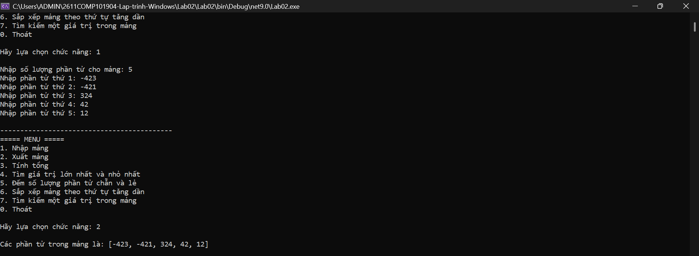
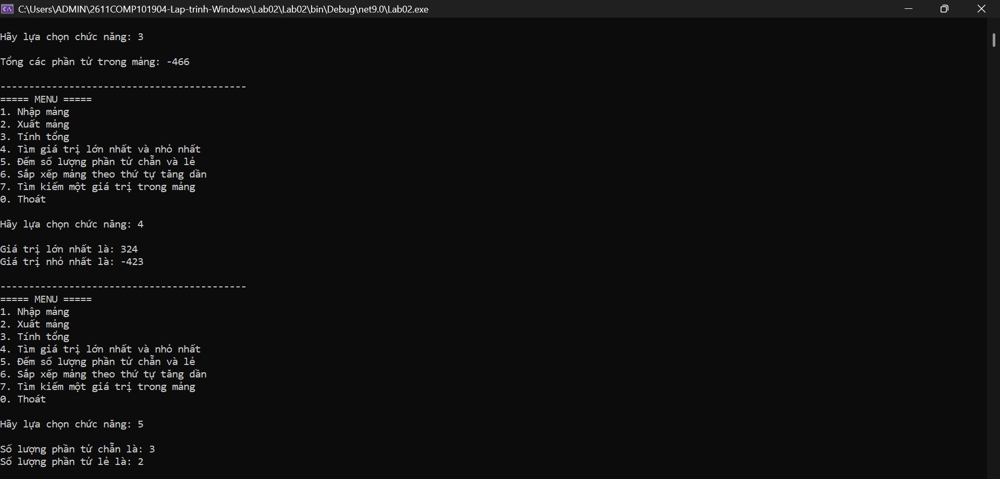
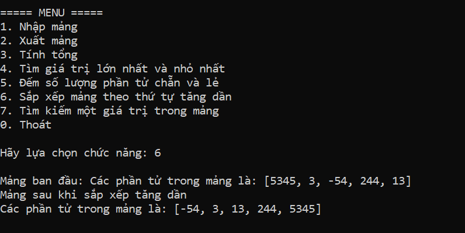
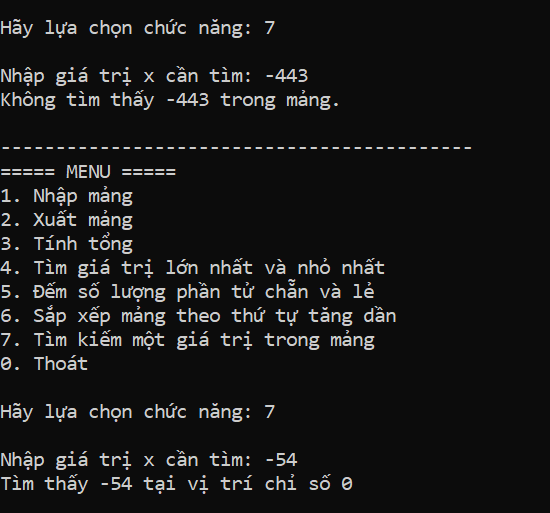
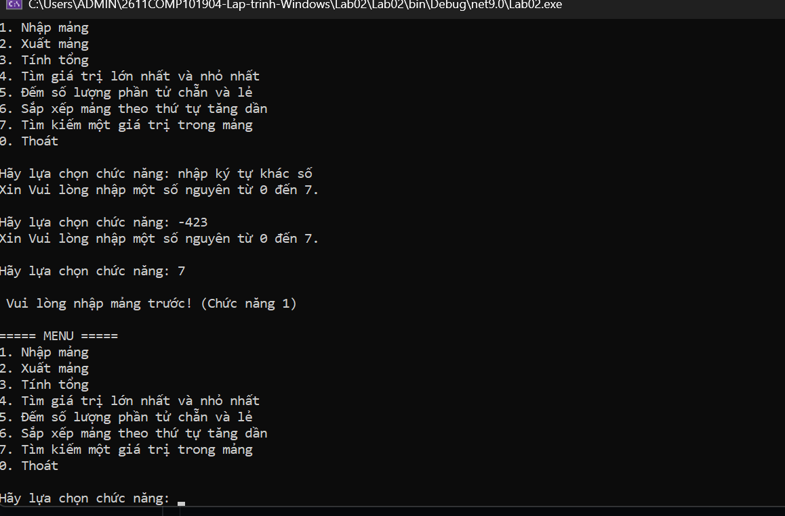

# COMP1019 - Lab 02: Quản lý mảng số nguyên bằng Console

## 1. Mô tả bài tập

Chương trình Console dùng để quản lý một mảng số nguyên. Người dùng lựa chọn các chức năng thông qua menu và chương trình tiếp tục chạy cho đến khi chọn **0 - Thoát**.

Bài lab tập trung vào biến, kiểu dữ liệu, toán tử, điều kiện, vòng lặp, mảng một chiều, phương thức và kiểm tra dữ liệu nhập.

## 2. Chức năng chương trình

| Lựa chọn | Chức năng | Mô tả |
|---|---|---|
| 1 | Nhập mảng | Nhập số lượng phần tử `n` và các phần tử của mảng. |
| 2 | Xuất mảng | In toàn bộ phần tử trong mảng. |
| 3 | Tính tổng | Tính và hiển thị tổng các phần tử. |
| 4 | Tìm lớn nhất và nhỏ nhất | Tìm và hiển thị giá trị lớn nhất, nhỏ nhất. |
| 5 | Đếm chẵn/lẻ | Đếm số lượng phần tử chẵn và lẻ. |
| 6 | Sắp xếp tăng dần | Sắp xếp mảng theo thứ tự tăng dần và hiển thị kết quả. |
| 7 | Tìm kiếm | Nhập `x`, kiểm tra `x` có trong mảng hay không và nếu có thì hiển thị vị trí xuất hiện đầu tiên. |
| 0 | Thoát | Kết thúc chương trình. |

## 3. Các phương thức chính

Chương trình được tách thành nhiều phương thức để dễ đọc, dễ kiểm tra và đúng yêu cầu kỹ thuật:

```csharp
static int NhapSoNguyen(string message)
static int NhapSoNguyenDuong(string message)
static int[] NhapMang()
static void XuatMang(int[] a)
static int TinhTong(int[] a)
static int TimMax(int[] a)
static int TimMin(int[] a)
static int DemChan(int[] a)
static int DemLe(int[] a)
static void SapXepTangDan(int[] a)
static int TimKiem(int[] a, int x)
```

## 4. Kiểm tra dữ liệu nhập

- Lựa chọn menu phải là số nguyên từ `0` đến `7`.
- Số lượng phần tử `n` phải là số nguyên dương.
- Các phần tử của mảng phải là số nguyên.
- Giá trị tìm kiếm `x` phải là số nguyên.
- Không cho thực hiện các chức năng từ 2 đến 7 khi chưa nhập mảng.
- Khi nhập sai dữ liệu, chương trình yêu cầu nhập lại thay vì dừng bất thường.

## 5. Hình ảnh minh chứng

### Giao diện menu


### Nhập và xuất mảng



### Tính tổng, Max/Min, chẵn/lẻ



### Sắp xếp tăng dần



### Tìm kiếm



### Kiểm tra dữ liệu nhập sai



## 6. Kết luận

Lab 02 giúp củng cố kiến thức C# cơ bản thông qua việc xây dựng chương trình quản lý mảng số nguyên bằng Console. Chương trình có menu điều khiển, kiểm tra dữ liệu nhập và được chia thành các phương thức riêng cho từng chức năng.
