\# LAB 03 – QUẢN LÝ SINH VIÊN


\## 1. Thông tin bài lab


\- \*\*Học phần:\*\* COMP1019 – Lập trình trên Windows

\- \*\*Bài:\*\* Lab 03 – C# và lập trình hướng đối tượng

\- \*\*Chủ đề:\*\* Quản lý sinh viên bằng Console

\- \*\*Ngôn ngữ:\*\* C#

\- \*\*Môi trường:\*\* Visual Studio

\- \*\*Hình thức:\*\* Cá nhân


\---


\## 2. Mục tiêu


Xây dựng chương trình Console quản lý sinh viên bằng C#, áp dụng các kiến thức:


\- Class và Object

\- Property

\- Constructor

\- Encapsulation

\- Inheritance

\- Polymorphism

\- List<T>

\- LINQ

\- Xử lý dữ liệu nhập vào và kiểm tra dữ liệu hợp lệ


\---


\## 3. Chức năng chính


Chương trình cung cấp các chức năng:


1\. Thêm sinh viên

2\. Hiển thị danh sách sinh viên

3\. Tìm sinh viên theo mã

4\. Tìm sinh viên theo tên

5\. Sửa điểm trung bình

6\. Xóa sinh viên

7\. Sắp xếp sinh viên theo điểm giảm dần

8\. Lọc sinh viên đạt với điểm trung bình từ 5 trở lên

9\. Thoát chương trình


\---


\## 4. Kiến thức OOP được áp dụng


\### Lớp `Nguoi`


Lớp cơ sở lưu thông tin chung của một người:


\- Họ tên

\- Ngày sinh

\- Constructor

\- Phương thức `LayThongTin()`


\### Lớp `SinhVien`


Kế thừa từ lớp `Nguoi`, bổ sung:


\- Mã sinh viên

\- Mã lớp

\- Điểm trung bình

\- Xếp loại sinh viên


Lớp `SinhVien` ghi đè phương thức `LayThongTin()` của lớp `Nguoi`.


\### Lớp `QuanLySinhVien`


Có nhiệm vụ quản lý danh sách sinh viên và thực hiện:


\- Thêm

\- Tìm kiếm

\- Sửa

\- Xóa

\- Sắp xếp

\- Lọc danh sách


Danh sách sinh viên được lưu bằng `List<SinhVien>`.


\### Lớp `Program`


Chịu trách nhiệm:


\- Hiển thị menu

\- Nhận lựa chọn từ người dùng

\- Nhập dữ liệu

\- Điều khiển luồng hoạt động của chương trình


\---


\## 5. Kiểm tra dữ liệu


Chương trình có kiểm tra dữ liệu nhập vào:


\- Mã sinh viên không được trùng.

\- Điểm trung bình phải nằm trong khoảng từ 0 đến 10.

\- Ngày sinh phải đúng định dạng.

\- Lựa chọn menu phải là số hợp lệ.

\- Chương trình không bị dừng khi người dùng nhập sai kiểu dữ liệu.


\---


\## 6. Kết quả chạy chương trình


\## 6.1. Menu chính


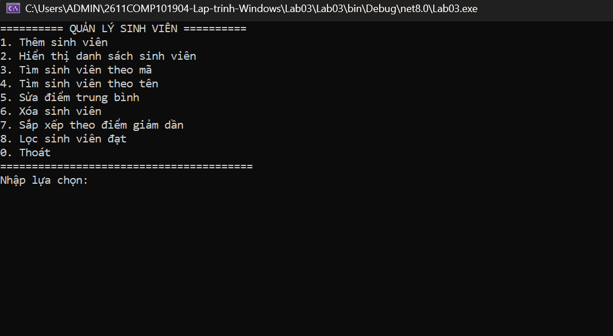


\---


\## 6.2. Thêm sinh viên


Chương trình cho phép nhập mã sinh viên, họ tên, ngày sinh, mã lớp và điểm trung bình.


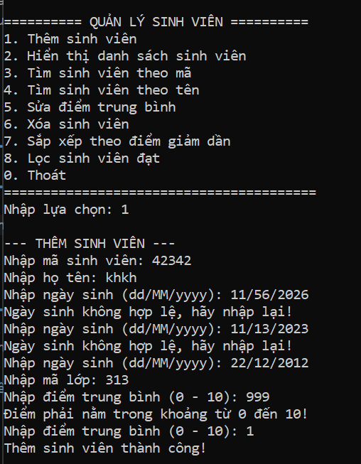


\---


\## 6.3. Kiểm tra mã sinh viên trùng


Khi nhập lại một mã sinh viên đã tồn tại, chương trình thông báo:


```text

Mã sinh viên đã tồn tại!

```


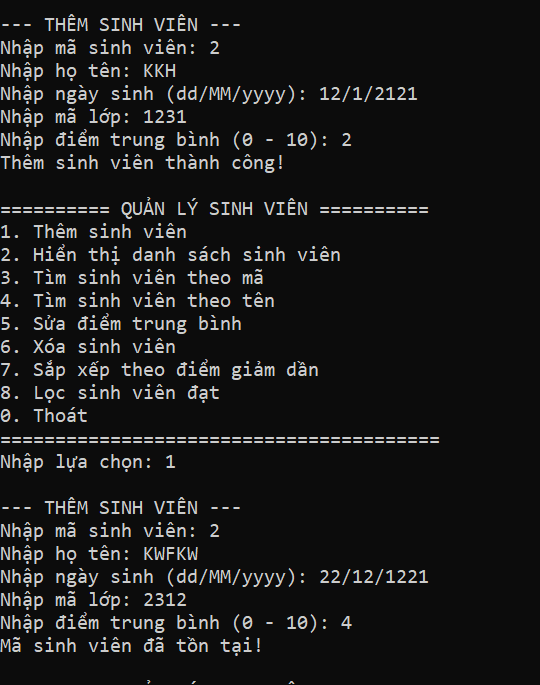


\---


\## 6.4. Kiểm tra điểm không hợp lệ


Ví dụ nhập điểm `11` hoặc `-1`, chương trình yêu cầu nhập lại.


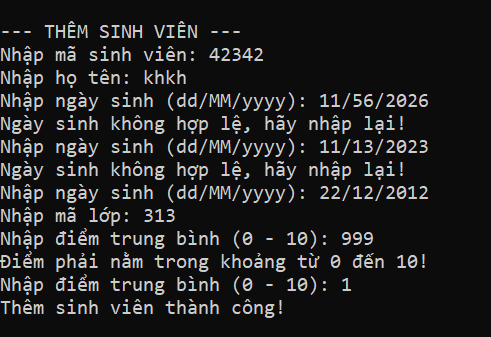


\---


\## 6.5. Xuất danh sách sinh viên


Thông tin hiển thị gồm:


\* Mã sinh viên

\* Họ tên

\* Ngày sinh

\* Lớp

\* Điểm trung bình

\* Xếp loại


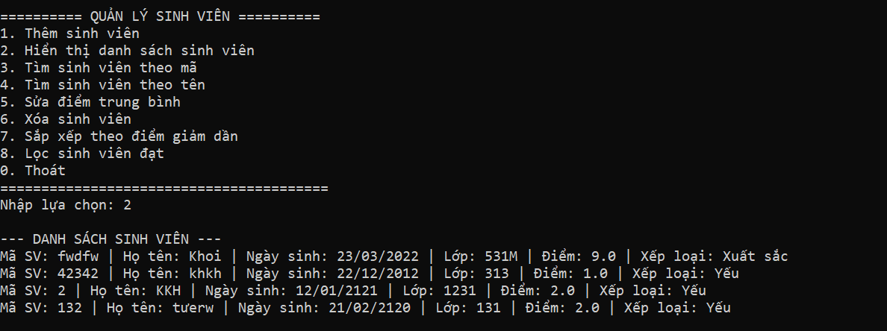


\---


\## 6.6. Tìm sinh viên theo mã


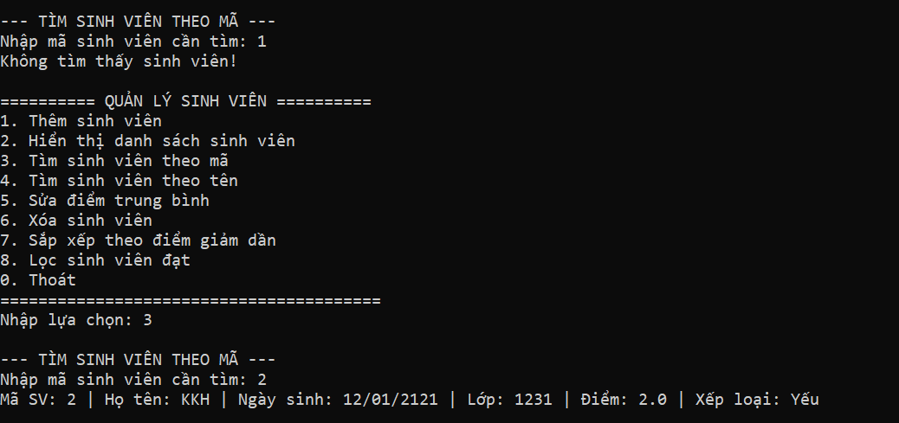


\---


\## 6.7. Tìm sinh viên theo tên


Có thể nhập từ khóa như `Nguyễn` để tìm các sinh viên có họ tên chứa từ khóa.


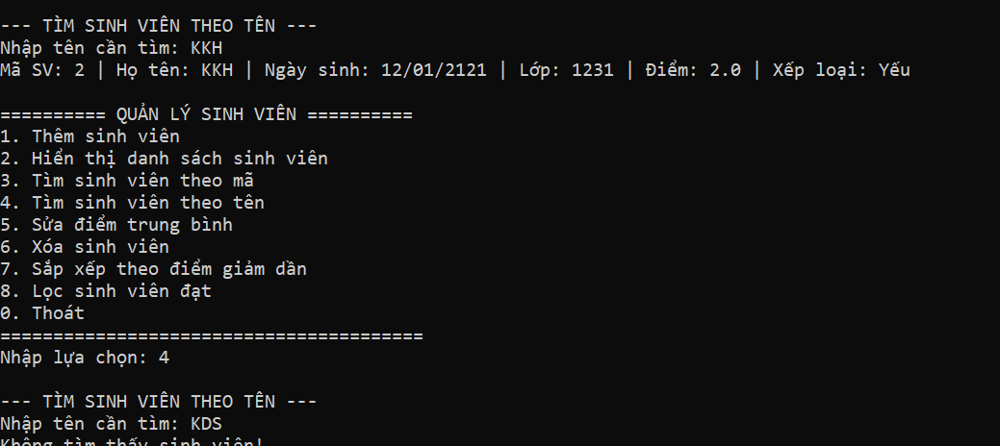


\---


\## 6.8. Sửa điểm


Người dùng nhập mã sinh viên và điểm mới.


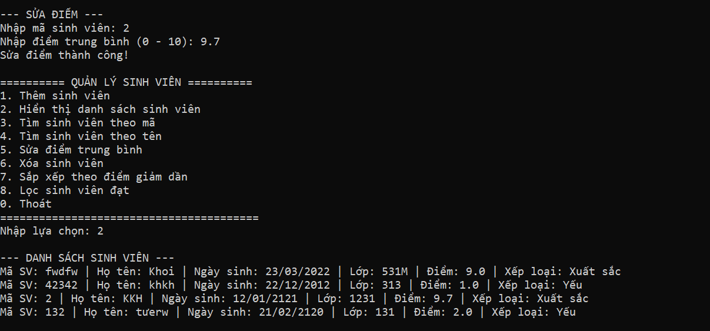


\---


\## 6.9. Xóa sinh viên


Người dùng nhập mã sinh viên cần xóa. Nếu mã không tồn tại, chương trình thông báo không tìm thấy.


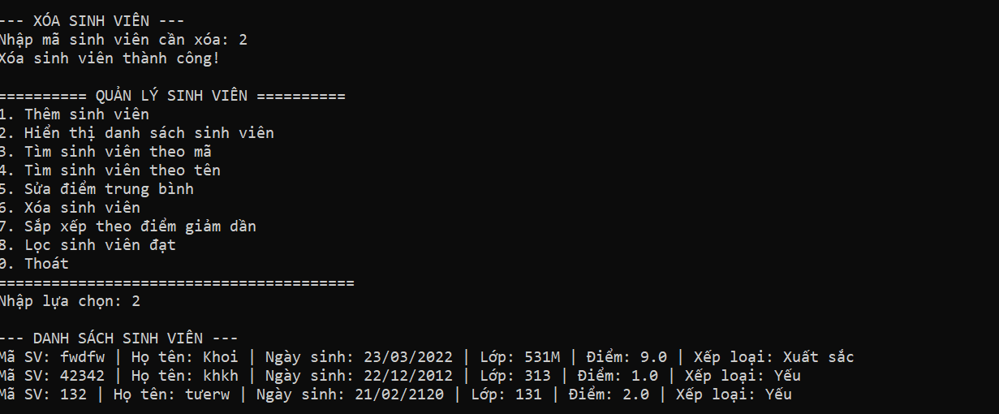


\---


\## 6.10. Sắp xếp theo điểm giảm dần


Danh sách sinh viên được sắp xếp từ điểm cao xuống điểm thấp.


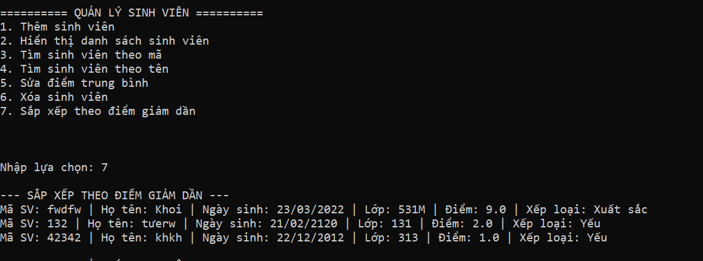


\---


\## 6.11. Lọc sinh viên đạt


Chỉ hiển thị các sinh viên có điểm trung bình từ `5` trở lên.


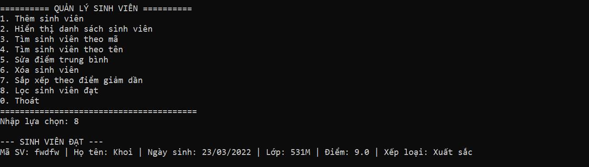


\---


\# 7. Đối chiếu yêu cầu


| Yêu cầu                          | Kết quả      |

| -------------------------------- | ------------ |

| Class `Nguoi`                    | Đã thực hiện |

| Class `SinhVien` kế thừa `Nguoi` | Đã thực hiện |

| Constructor `Nguoi`              | Đã thực hiện |

| Constructor `SinhVien`           | Đã thực hiện |

| Property kiểm tra điểm 0–10      | Đã thực hiện |

| Override `LayThongTin()`         | Đã thực hiện |

| `List<SinhVien>`                 | Đã thực hiện |

| Thêm sinh viên                   | Đã thực hiện |

| Kiểm tra mã trùng                | Đã thực hiện |

| Xuất danh sách                   | Đã thực hiện |

| Tìm theo mã                      | Đã thực hiện |

| Tìm theo tên                     | Đã thực hiện |

| LINQ                             | Đã sử dụng   |

| Sửa điểm                         | Đã thực hiện |

| Xóa sinh viên                    | Đã thực hiện |

| Sắp xếp điểm giảm dần            | Đã thực hiện |

| Lọc sinh viên đạt                | Đã thực hiện |

| Kiểm tra input không hợp lệ      | Đã thực hiện |

| Tách class và method             | Đã thực hiện |


\---


\# 8. Kết quả


Chương trình đã hoàn thành các chức năng quản lý sinh viên theo yêu cầu của Lab 03:


\* Thêm sinh viên

\* Xuất danh sách

\* Tìm kiếm theo mã

\* Tìm kiếm theo tên

\* Sửa điểm

\* Xóa sinh viên

\* Sắp xếp theo điểm giảm dần

\* Lọc sinh viên đạt


Bài làm đồng thời áp dụng các kiến thức về \*\*class, property, constructor, kế thừa, đa hình, List và LINQ\*\* trong C#.

\## 9. Cấu trúc project


```text

Lab03/

├── README.md

├── images/

└── Lab03/

&#x20;   ├── Lab03.sln

&#x20;   ├── Lab03.csproj

&#x20;   ├── Program.cs

&#x20;   ├── Nguoi.cs

&#x20;   ├── SinhVien.cs

&#x20;   └── QuanLySinhVien.cs


