# COMP1019 - Lập trình trên Windows

## BUỔI 4 - LAB 04: Exception, Delegate/Event, Func/Action và Generic trong C#

---

## 1. Giới thiệu

Bài Lab 04 xây dựng chương trình **quản lý sản phẩm bằng Console C#**.

Chương trình sử dụng `Repository<T>` để lưu trữ sản phẩm trong bộ nhớ và áp dụng các kiến thức:

* Exception và xử lý lỗi bằng `try-catch`
* Exception tự tạo
* Event / Action event
* `Func<Product, bool>` để tìm kiếm và lọc
* Generic class `Repository<T>`
* Interface `IEntity`
* Tách xử lý nghiệp vụ ra khỏi `Main`

Chương trình hỗ trợ thêm, xuất danh sách, tìm kiếm, lọc, xóa sản phẩm và tính tổng giá trị kho.

---

## 2. Cấu trúc chương trình

Chương trình được chia thành các class chính:

### `IEntity`

Định nghĩa thuộc tính `Id` để làm ràng buộc cho `Repository<T>`.

```csharp
public interface IEntity
{
    string Id { get; }
}
```

### `Product`

Lớp biểu diễn thông tin sản phẩm gồm:

* `MaSP`: Mã sản phẩm
* `TenSP`: Tên sản phẩm
* `Price`: Đơn giá
* `Quantity`: Số lượng

Lớp có constructor, property và ghi đè `ToString()`.

Giá và số lượng được kiểm tra để không nhận giá trị âm.

### `DuplicateProductException`

Exception tự tạo, được sử dụng khi người dùng thêm sản phẩm có mã đã tồn tại.

### `ProductNotFoundException`

Exception tự tạo, được sử dụng khi thực hiện thao tác với sản phẩm không tồn tại.

### `Repository<T>`

Là generic class dùng để quản lý danh sách đối tượng.

Repository sử dụng constraint:

```csharp
where T : IEntity
```
### `ProductService`

Xử lý các nghiệp vụ liên quan đến sản phẩm:

* Thêm sản phẩm
* Xóa sản phẩm
* Tìm kiếm sản phẩm
* Lọc sản phẩm
* Kiểm tra mã sản phẩm trùng
* Kiểm tra sản phẩm không tồn tại
* Phát event khi thêm hoặc xóa thành công

### `Program`

Chứa `Main()` và menu chính.

`Program` chịu trách nhiệm nhập dữ liệu, hiển thị kết quả và bắt các exception phát sinh từ chương trình.

---

## 3. Chức năng chương trình

Menu chính của chương trình:

```text
===== PRODUCT MANAGER =====
1. Them san pham
2. Xuat danh sach
3. Tim theo ma
4. Tim theo ten
5. Loc theo khoang gia
6. Xoa san pham
7. Tinh tong gia tri kho
0. Thoat
Chon:
```

---

## 4. Kết quả chạy chương trình

### 4.1. Menu chính

Chương trình hiển thị menu gồm các chức năng quản lý sản phẩm.

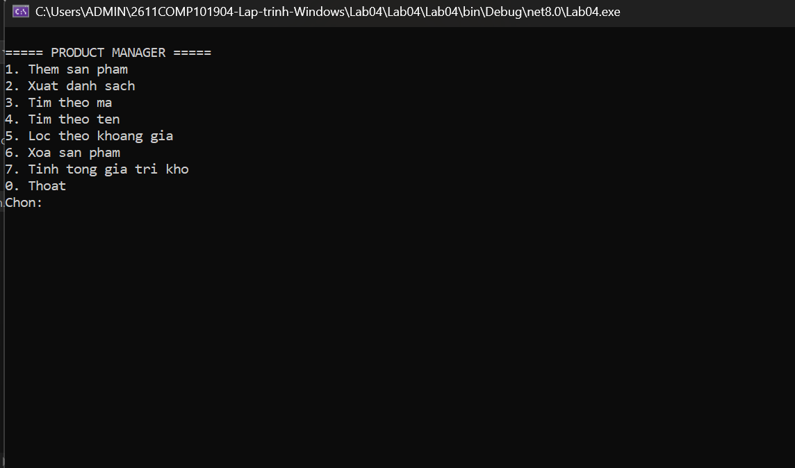

---

### 4.2. Thêm sản phẩm

Người dùng nhập mã sản phẩm, tên sản phẩm, đơn giá và số lượng.

Sau khi thêm thành công, chương trình phát event để thông báo.

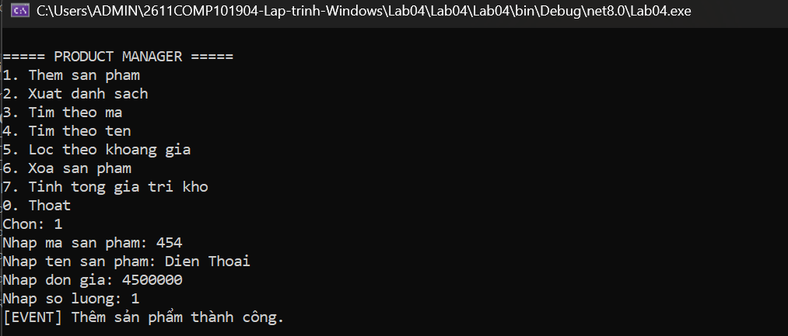

---

### 4.3. Xuất danh sách sản phẩm

Chương trình hiển thị toàn bộ sản phẩm hiện có trong `Repository<Product>`.

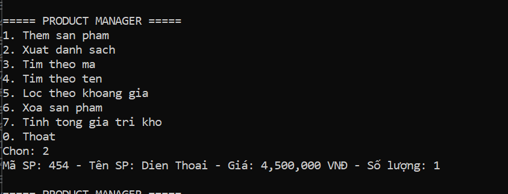

---

### 4.4. Tìm sản phẩm theo mã

Người dùng nhập mã sản phẩm cần tìm. Nếu sản phẩm tồn tại, chương trình hiển thị thông tin sản phẩm.

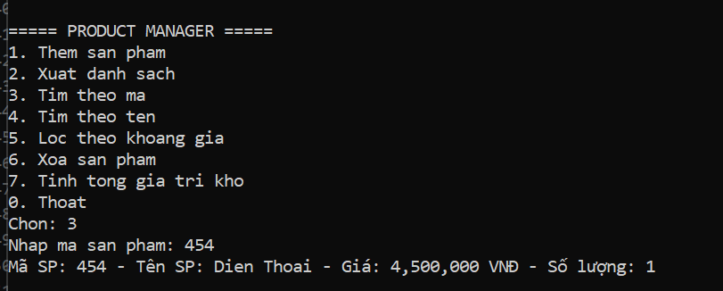

---

### 4.5. Tìm sản phẩm theo tên

Người dùng nhập từ khóa. Chương trình sử dụng điều kiện tìm kiếm để lấy các sản phẩm có tên chứa từ khóa.

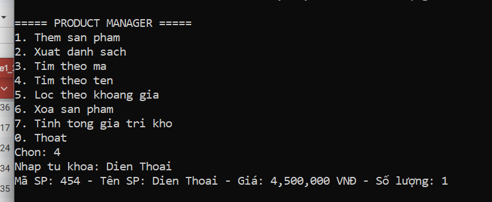

---

### 4.6. Lọc sản phẩm theo khoảng giá

Người dùng nhập giá nhỏ nhất và giá lớn nhất.

Chương trình sử dụng:

```csharp
Func<Product, bool>
```

để lọc các sản phẩm nằm trong khoảng giá đã nhập.

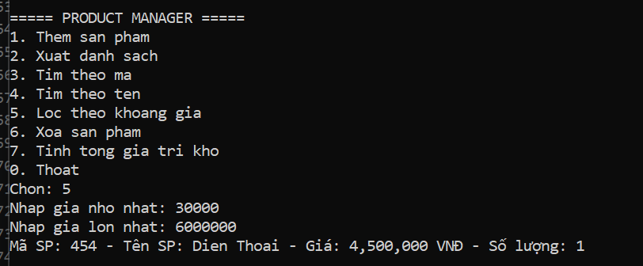

---

### 4.7. Xóa sản phẩm

Người dùng nhập mã sản phẩm cần xóa.

Nếu sản phẩm tồn tại, chương trình thực hiện xóa và phát event thông báo xóa thành công.

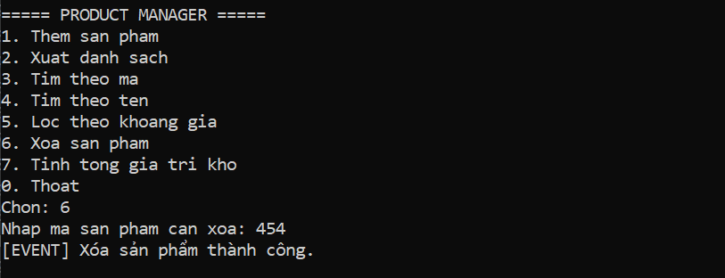

---

### 4.8. Tính tổng giá trị kho

Chương trình tính tổng giá trị của toàn bộ sản phẩm theo công thức:

```text
Tổng giá trị kho = Đơn giá × Số lượng
```

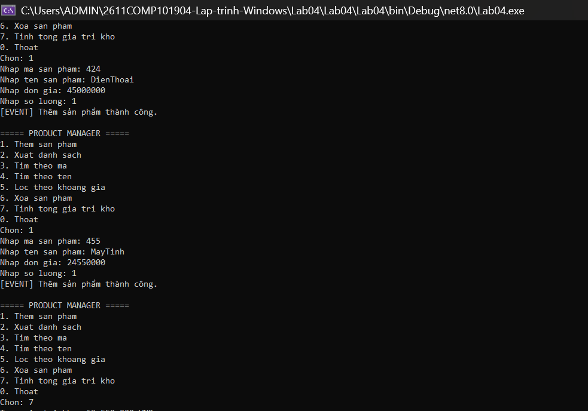

---

### 4.9. Xử lý lỗi

Chương trình sử dụng `try-catch` để xử lý các trường hợp nhập dữ liệu không hợp lệ và các exception tự tạo.

Các trường hợp được xử lý gồm:

* Nhập sai kiểu dữ liệu
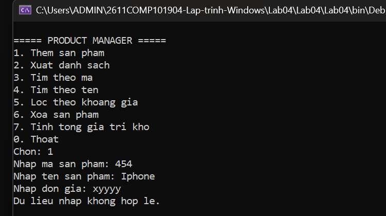
* Mã sản phẩm bị trùng
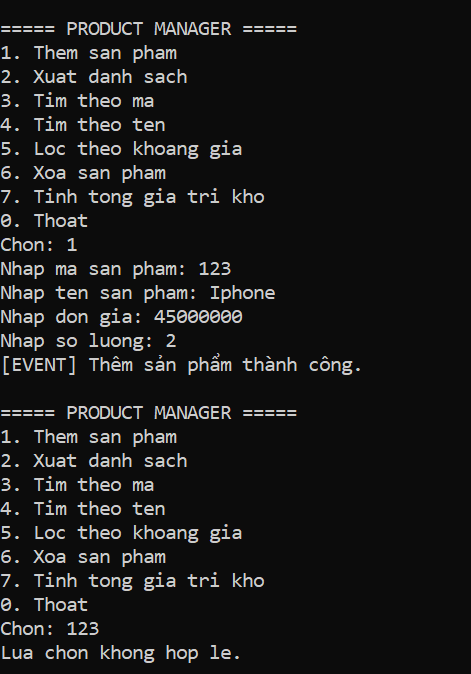
* Xoá Sản phẩm không tồn tại
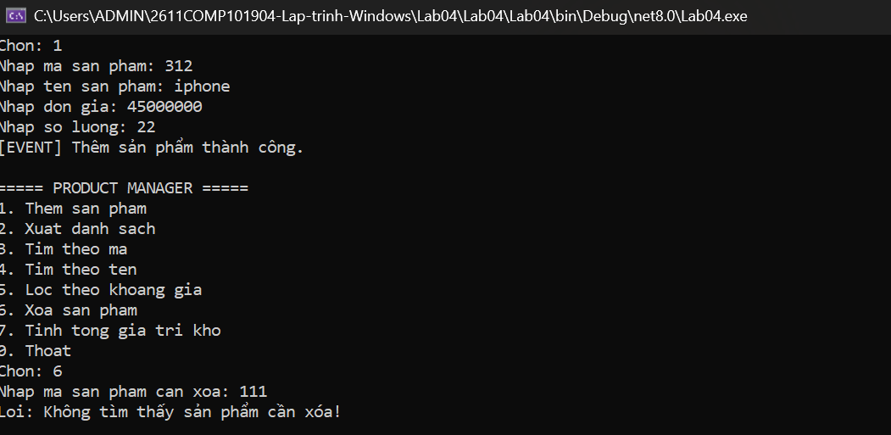
* Nhập số âm khi add sp và nhập số ngoài menu
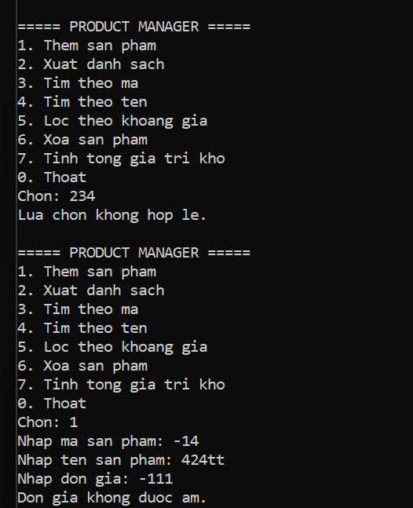

Chương trình không bị dừng đột ngột khi người dùng nhập sai.


---

## 5. Kết luận

Qua bài Lab 04, chương trình đã áp dụng các kiến thức về **Exception, Custom Exception, Event, Func và Generic** trong C#.

Chương trình được tách thành nhiều class để quản lý dữ liệu và xử lý nghiệp vụ, giúp `Main()` không chứa toàn bộ phần xử lý của chương trình.
