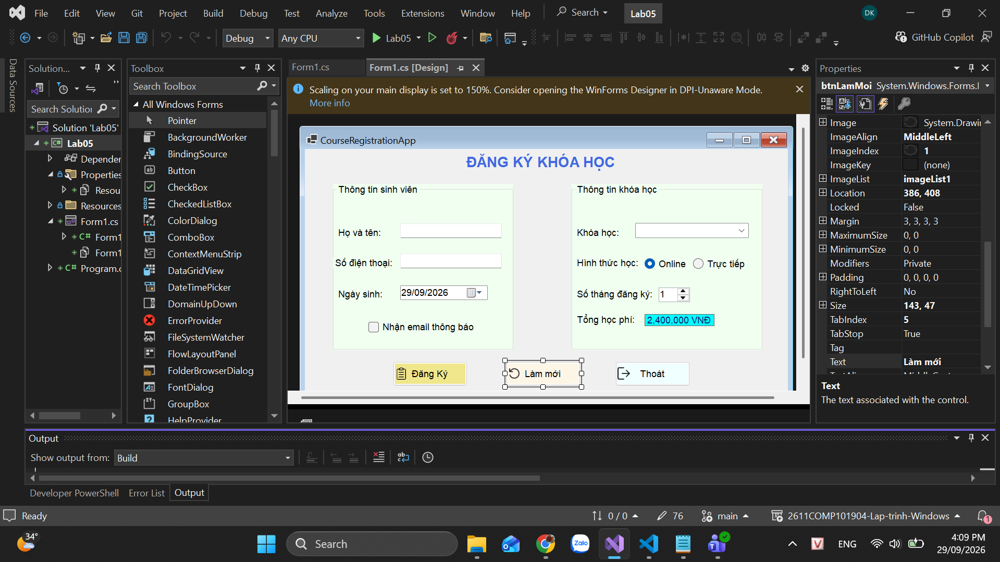
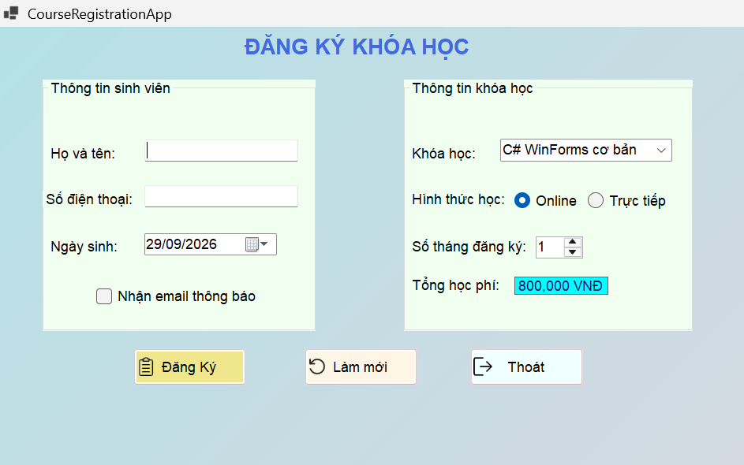
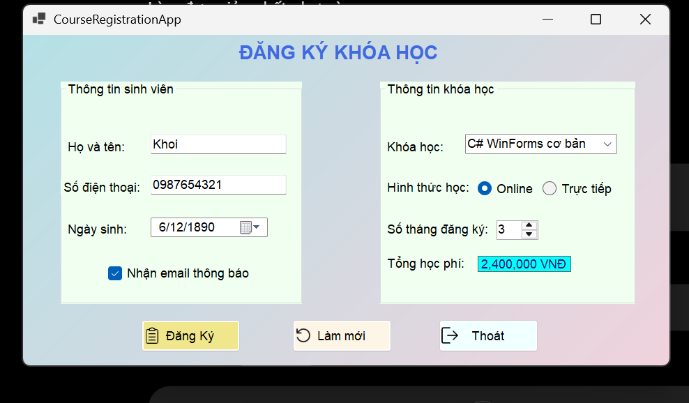
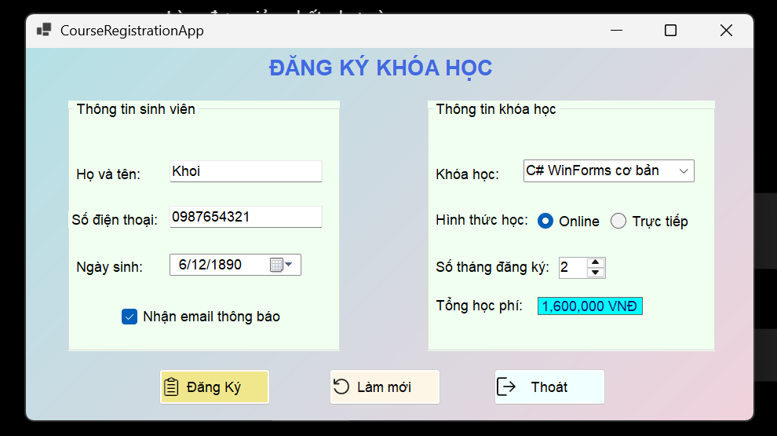
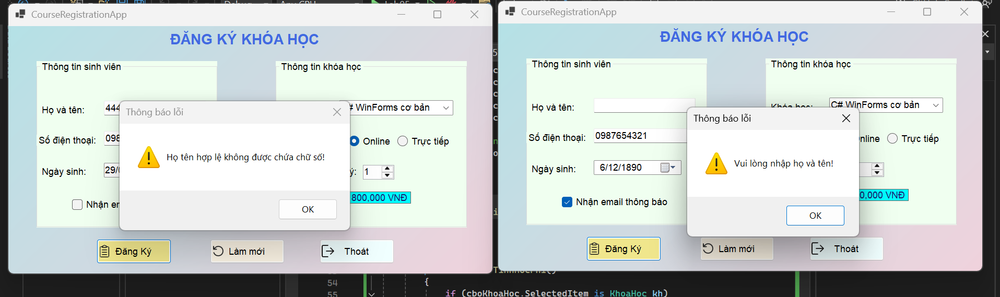
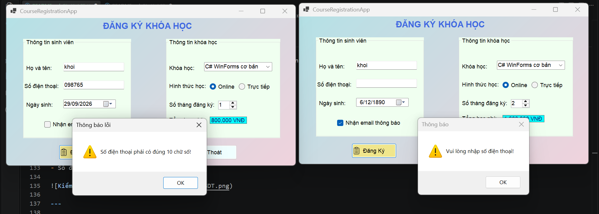
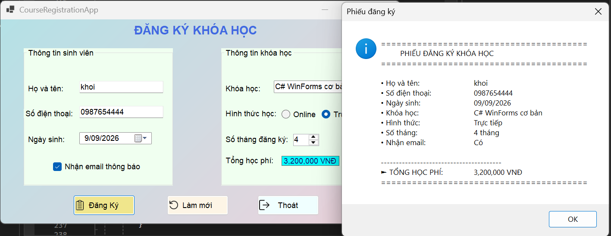
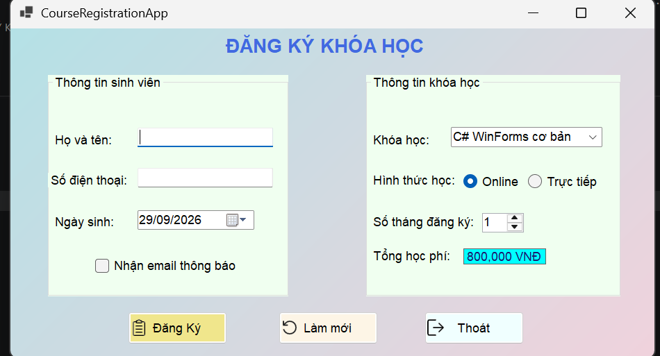
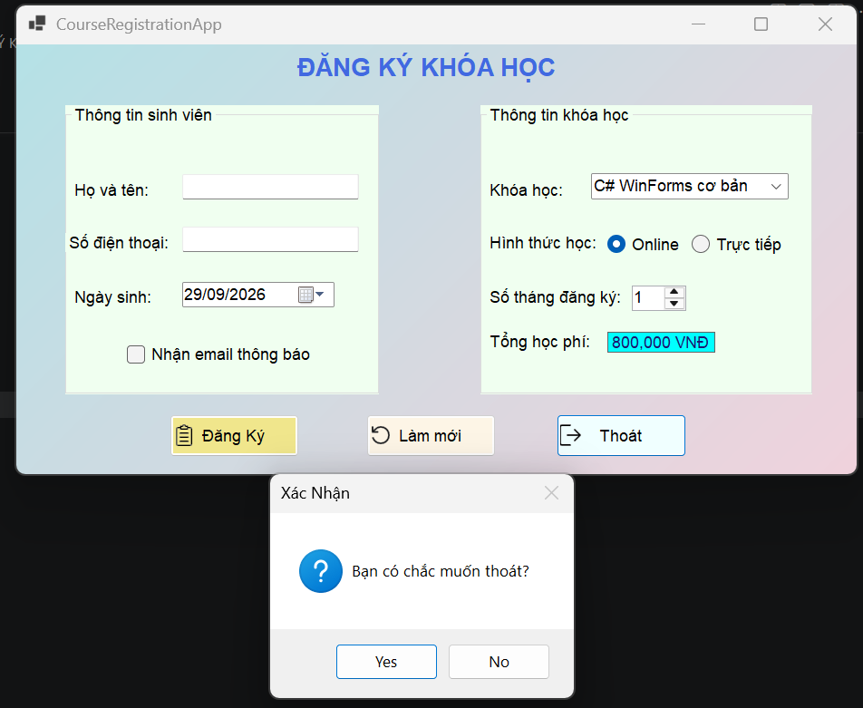

# COMP1019 - LAB 05
# ỨNG DỤNG ĐĂNG KÝ KHÓA HỌC

## 1. Thông tin bài thực hành

- **Học phần:** COMP1019 - Lập trình trên Windows
- **Buổi:** 5 - Windows Forms cơ bản
- **Ngôn ngữ:** C#
- **Nền tảng:** Windows Forms
- **Tên ứng dụng:** CourseRegistrationApp

---

## 2. Mô tả chương trình

Ứng dụng được xây dựng bằng C# Windows Forms, dùng để đăng ký khóa học.

Chương trình cho phép người dùng:

- Nhập thông tin học viên.
- Chọn ngày sinh.
- Chọn khóa học.
- Chọn hình thức học Online hoặc Trực tiếp.
- Chọn số tháng đăng ký.
- Chọn nhận email thông báo.
- Tự động tính tổng học phí.
- Kiểm tra dữ liệu trước khi đăng ký.
- Hiển thị phiếu đăng ký bằng MessageBox.
- Làm mới thông tin.
- Xác nhận trước khi thoát chương trình.

---

## 3. Giao diện chương trình

Giao diện chương trình gồm hai nhóm thông tin:

- **Thông tin học viên**
- **Thông tin khóa học**

Ngoài ra có vùng chứa các nút lệnh:

- Đăng ký
- Làm mới
- Thoát

---

## 4. Các control sử dụng

| Nhóm | Control | Tên control |
|---|---|---|
| Thông tin học viên | TextBox | `txtHoTen` |
| Thông tin học viên | TextBox | `txtSoDienThoai` |
| Thông tin học viên | DateTimePicker | `dtpNgaySinh` |
| Thông tin học viên | CheckBox | `chkNhanEmail` |
| Thông tin khóa học | ComboBox | `cboKhoaHoc` |
| Thông tin khóa học | RadioButton | `radOnline` |
| Thông tin khóa học | RadioButton | `radOffline` |
| Thông tin khóa học | NumericUpDown | `numSoThang` |
| Thông tin khóa học | Label | `lblTongTien` |
| Nút lệnh | Button | `btnDangKy` |
| Nút lệnh | Button | `btnLamMoi` |
| Nút lệnh | Button | `btnThoat` |

---

## 5. Danh sách khóa học

Chương trình có 4 khóa học theo yêu cầu đề bài:

| Khóa học | Học phí/tháng |
|---|---:|
| C# WinForms cơ bản | 800.000 VNĐ |
| SQL Server cơ bản | 700.000 VNĐ |
| Web Frontend cơ bản | 750.000 VNĐ |
| Lập trình Python cơ bản | 650.000 VNĐ |

---

## 6. Thực thi chương trình

### 6.1. Khởi động chương trình

Khi chương trình được mở:

- Danh sách khóa học được nạp vào ComboBox.
- Khóa học đầu tiên được chọn mặc định.
- Hình thức Online được chọn mặc định.
- Số tháng mặc định là 1.
- Số tháng được giới hạn từ 1 đến 12.
- Tổng học phí ban đầu được hiển thị.

---

### 6.2. Tính học phí

Tổng học phí được tính theo công thức:

**Tổng học phí = Học phí một tháng × Số tháng đăng ký**

Khi thay đổi khóa học hoặc số tháng đăng ký, tổng học phí được cập nhật tự động.

2 ẢNH THỂ HIỆN HỌC PHÍ TỰ ĐỘNG THAY ĐỔI THEO SỐ THÁNG ĐÃ CHỌN

---

### 6.3. Kiểm tra họ tên

Chương trình kiểm tra:

- Họ tên không được để trống.
- Họ tên không được chứa chữ số.

Nếu dữ liệu không hợp lệ, chương trình hiển thị thông báo và đưa con trỏ về ô nhập họ tên.

---

### 6.4. Kiểm tra số điện thoại

Chương trình kiểm tra:

- Số điện thoại không được để trống.
- Số điện thoại phải có đúng 10 chữ số.
- Số điện thoại chỉ được chứa các chữ số.

---

### 6.5. Đăng ký khóa học

Sau khi nhập đầy đủ thông tin và nhấn **Đăng ký**, chương trình hiển thị phiếu đăng ký bằng MessageBox.

Phiếu đăng ký gồm:

- Họ và tên.
- Số điện thoại.
- Ngày sinh.
- Khóa học.
- Hình thức học.
- Số tháng.
- Trạng thái nhận email.
- Tổng học phí.

---

### 6.6. Làm mới thông tin

Khi nhấn **Làm mới**, chương trình:

- Xóa họ tên.
- Xóa số điện thoại.
- Đưa ngày sinh về ngày hiện tại.
- Bỏ chọn nhận email.
- Chọn lại khóa học đầu tiên.
- Chọn lại hình thức Online.
- Đưa số tháng về 1.
- Cập nhật lại tổng học phí.
- Đưa con trỏ về ô họ tên.

---

### 6.7. Thoát chương trình

Khi nhấn **Thoát**, chương trình hiển thị hộp thoại xác nhận.

- Chọn **Yes**: đóng Form.
- Chọn **No**: tiếp tục sử dụng chương trình.

---

## 7. Kết quả

Chương trình đã thực hiện được các chức năng chính theo yêu cầu của Lab 05:

- Thiết kế giao diện Windows Forms.
- Nhập và kiểm tra thông tin học viên.
- Lựa chọn khóa học và hình thức học.
- Tính tổng học phí theo số tháng.
- Hiển thị phiếu đăng ký.
- Làm mới dữ liệu.
- Xác nhận trước khi thoát.

---

## 8. Kết luận

Bài thực hành đã áp dụng các kiến thức Windows Forms cơ bản trong C#, bao gồm:

- Thiết kế giao diện bằng Form Designer.
- Sử dụng các control cơ bản.
- Xử lý sự kiện `Load`.
- Xử lý sự kiện `Click`.
- Xử lý sự kiện `SelectedIndexChanged`.
- Xử lý sự kiện `ValueChanged`.
- Kiểm tra dữ liệu nhập.
- Tính toán và hiển thị kết quả bằng `MessageBox`.